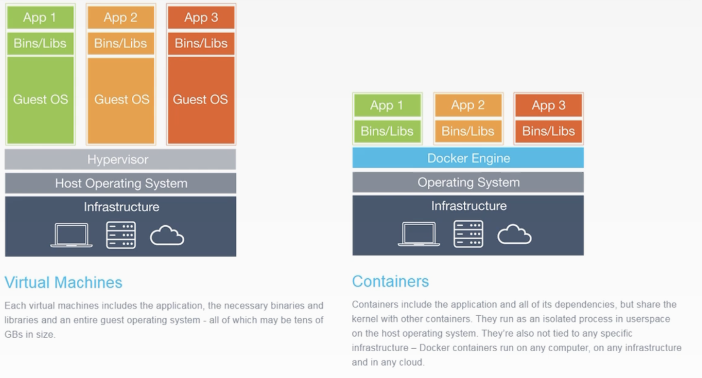
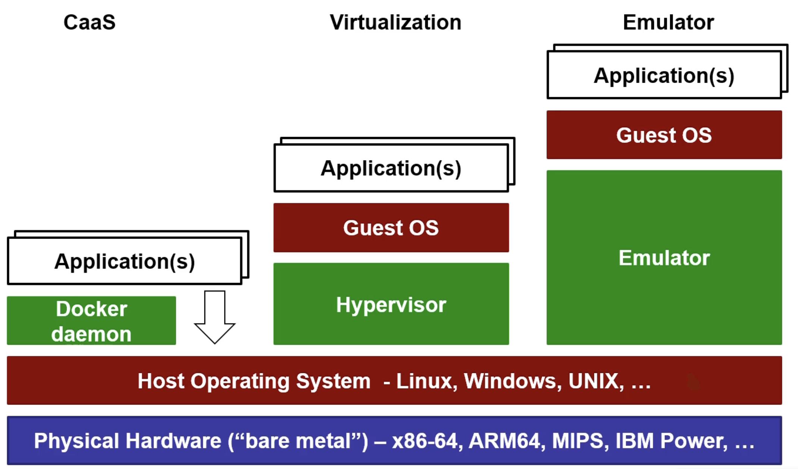
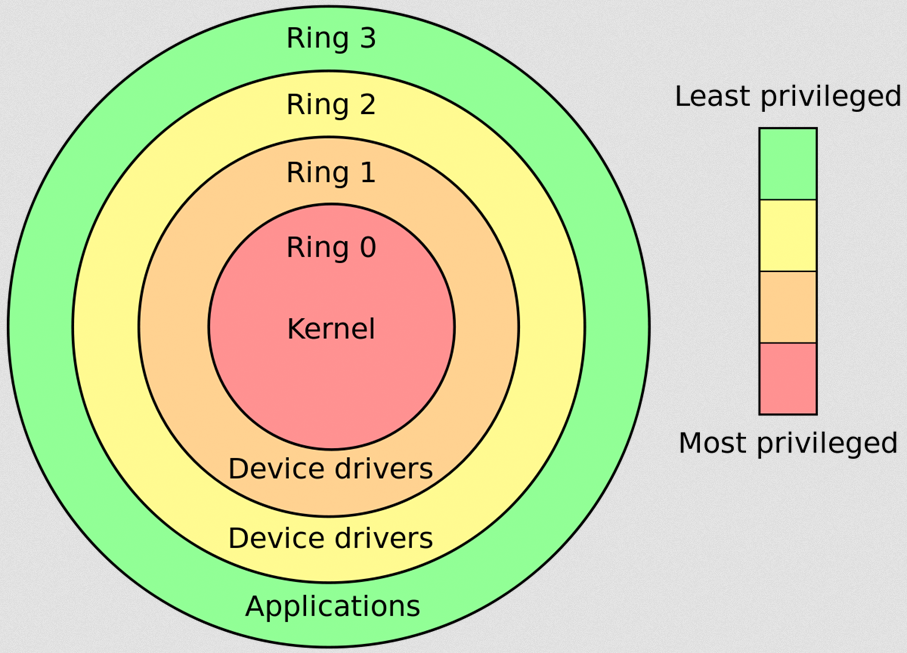
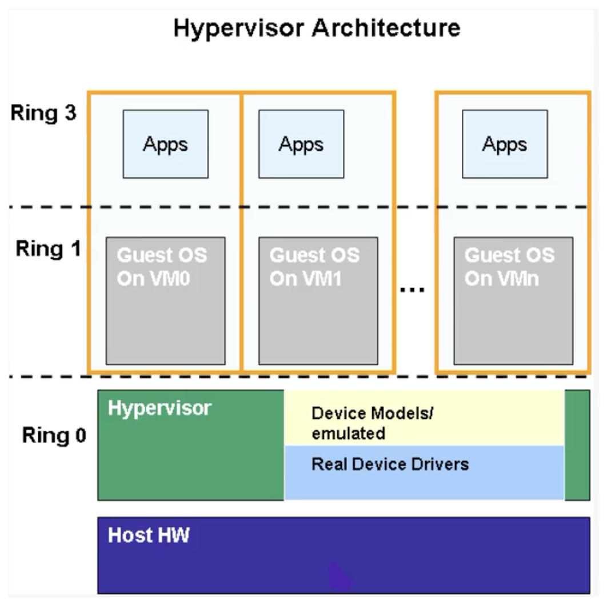

# CAB432 Study Guide | 2022 Semester 2

Associate Professor Jim Hogan | Notes for CAB432 at the Queensland University of Technology

<h1>Table of Contents</h1>
<ul>
	<li><a href="#CAB432">CAB432: Cloud Computing</a></li>
	<ul>
		<li><a href="#week1">Week 1</a>: Introduction</li>
		<li><a href="#week2">Week 2</a>: Docker</li>
		<li><a href="#week3">Week 3</a>: </li>
		<li><a href="#week4">Week 4</a>: </li>
		<li><a href="#week5">Week 5</a>: </li>
		<li><a href="#week6">Week 6</a>: </li>
		<li><a href="#week7">Week 7</a>: </li>
		<li><a href="#week8">Week 8</a>: </li>
		<li><a href="#week9">Week 9</a>: </li>
		<li><a href="#week10">Week 10</a>: </li>
		<li><a href="#week11">Week 11</a>: </li>
		<li><a href="#week12">Week 12</a>: </li>
		<li><a href="#week13">Week 13</a>: </li>
	</ul>
</ul>

 

<h1 id="CAB432">CAB432: Cloud Computing</h1>

Cloud Computing is among the most important developments in the IT industry in recent years, and one which has received enormous attention. Cloud is a natural progression from earlier trends in service and infrastructure outsourcing and virtualisation, but is distinguished by its elasticity and scale: service and infrastructure provisioning may change rapidly in response to variations in demand, allowing clients to cater for unexpected spikes in load without tying up capital in expensive and potentially underutilised assets. Cloud services and technologies are becoming increasingly diverse and sophisticated, moving rapidly from the original 'bare metal' offerings and providing a rich set of options and APIs. This unit provides a technically oriented introduction to Cloud Computing, giving you experience in developing modern cloud applications and deploying them to the public clouds of the major vendors.

 

<h2 id="week1">Week 1: Introduction</h2>

### What is Cloud Computing?
Cloud computing is, at its core, IT infrastructures and services that can be turned on when needed and are payed only when being used. These services can be scaled as needed and automatically adjust themselves based on the current load. Modern cloud computing operates as a global scale providing access to everyone, everywhere at anytime.

So what business case would there be for cloud computing? 
1. Only pay for what you use
2. Don't have to spend the money, time and resources to build server rooms and run them
3. Capacity is managed through elastic provisioning
4. Most major vendors provide unlimited capacity based on how much you pay

### Public, Private, and Hybrid Clouds

| Public Cloud | Private Cloud | Hybrid Cloud |
|--|--|--|
| Services offered by the major vendors | Services hosted and managed by large companies or government | Services based on a mix of public and private clouds |
| Available globally on a commercial basis | Same elastic service model but on a smaller scale | Often used to manage regulatory requirements and client concerns over location of sensitive data sets| 
| "Limited only by the size of your credit card" | Usually more limited service offerings | Government services, Major corporate's | 

### Cloud Pre-requisites

| Virtualisation | Elasticity | Scale |
|--|--|--|
| Costly to maintain lots of small machines | Measure load and automatically scale as needed | Cloud data centres are huge |
| Better to maintain lots of virtual machines (VM) in the one place | Scale out when people are waiting. Scale in when we have too many machines | Major vendors have nodes around the world and their own undersea cables |

### Virtualisation

| Virtualisation Layers |
|--|
| Application(s) |
| Guest OS (many) |
| Hypervisor |
| Host Operating System - Linux, Windows, UNIX... |
| Physical Hardware |

### Types of Cloud Services

| Infrastructure as a Service (IaaS) | Platform as a Service (PaaS) | Software as a Service (SaaS) |
|--|--|--|
| Virtual Machine + OS | Not just the OS | Application hosting in the cloud |
| Pick your size | Pre-configured software stack on each VM | Subscription-based |
| Storage - entity storage, SQL, NoSQL, archive | Managed provisioning and scaling | All hosting and management is done for you at a fee |
| Pick your DB | | Salesforce is usually used |

### Major Providers

#### Microsoft Azure
- Provide a mix of XaaS services but mainly provide IaaS and PaaS
- Their focus areas consist of big data and machine learning
- Azure SQL and SQL Server are two instances of services
- Cognitive Services and Azure ML are key offerings

#### Google Cloud Platform
- Provide a mix of IaaS and PaaS
- Their focus area is IaaS at a large scale
- PaaS remains through Servlet based AppEngine
- Have application areas in search tech, data and machine learning

#### Amazon Web Services
- Provide a mix of XaaS services 
- Huge range of elastic application services
- Have made major improvement in machine learning services in recent years
- Developing a focus on IoT

 

<h2 id="week2">Week 2: Docker</h2>

### Docker
Docker is a popular container as a service application that has command-line tools to run containers, create images and do much more. Docker can also be run inside of a Linux OS that is in itself being virtualised by a VM.

There are many reasons to use docker such as:
- Much more efficient use of "bare-metal" hardware resources
- Many more containers than virtual machines
- More efficient use of CPU cycles
- There is no need to maintain an entire operating system stack
- Easier management and orchestration
- Rebooting containers is much faster and easer than rebooting a VM

There are also however a few cons:
- Virtual machines allow for better isolation
- Containers may have port collisions
- Within containers there is no access OS-level daemons
- There is an assumption that guest software is compatible with Linux

### Containers
A container is an instance of an application(s), whether running, stopped or finished. These containers are installed on top of some "base image" with each container being isolated from other containers and from the guest OS (although they can interact with these throughout well-defined interfaces).

### Images
An image is a "pre-canned" software stack loaded from some repository, typically <a href="https://dockerhub.com">dockerhub.com</a>. An image acts as a blueprint for containers and follows a cookie-cutter model where as many identical images can be deployed as we want.

### Dockerfile
A docker file is a script used to build a docker image. These typically start with a base OS image and execute a sequence of commands consisting of installation and configuration tasks for the needed stack. A docker compose is a file that allows services and configurations for multi-container applications to be specified.

### Application Virtualisation Levels
- Typically layered on top of an operating system. This is usually Linux for a number of reasons.
- Things like hardware, firmware, OS, middleware and standard tools are not virtualised.
- Precise, user-defined set of software and configuration:
  - There is no need to clone a virtual machine leading to a faster and lighter experience
  - Scripts can instantiate a cloned container within a matter of seconds
  - Pre-canned scripts and images are able to be shared with others

### CaaS vs Virtualisation vs Emulators

### Why use Virtualisation
There are many reasons to use virtualisation such as:
- **Cost**: It is much cheeper to run virtual machines because it allows for fewer physical machines for the same amount of computation. 
- **Normalisation**: With normalisation we get:
  - Cookie cutter resources: All the resources are the same
  - To define an instance and machine image
  - Easier management and maintenance of units
- **Software Lifecycle**: The ability to deploy many identical machine images and update them all the same
- **Isolation**: Using isolation we can have many users on the same hardware with hard separation of virtualised resources
- **Instance Lifecycle**: Each instance we create can be:
  - Scaled up: Quickly replace the current resources with more powerful ones
  - Scale out: Quickly start up additional, identical instances
  - Continuity: Quick fail-over to another resource

### IaaS Challenges
Infrastructure as a service has a few challenges that come along with it:
- A heavyweight and complex hypervisor
- Performance and resource consumption
- Virtualisation of an entire guest OS. This means virtualising things like the kernel, device drivers, the filesystem, the network protocol stack, middleware, applications and many more.

### Hardware Virtualisation Terminology
- **Host OS**: The host operating system is the non-virtualised hardware resources. This is the "bare metal" running the hypervisor/VMM (typically your physical device).
- **Guest OS**: The guest operating system is the operating system running inside of virtualised hardware.
- **Hypervisor**: Hypervisor is the software that runs the virtual machine itself. There are 2 types:
  - Type 1: This runs directly on the hardware (like an operating system)
  - Type 2: This runs inside of an operating system 

### CPU Protection Layers

- **Kernal mode (ring 0)**: Privileged instructions such as interrupts or memory management. These instructions are generally reserved for the OS kernel with applications not normally being able to see them.
- **User mode (ring 3)**: Non-privileged or "safe" instructions. Application software will ask the kernel to perform privileged instructions on it's behalf. In this mode the Guest OS is given higher privileges via the hypervisor.

### Hardware Assisted Virtualisation Basics

### Hardware Emulation
Hardware emulators are full or partial software implementations of the hardware which use binary translation to convert some instruction to another e.g. ARM to x86, PowerPC to x86. One of the major pros to this is that we can emulate other instruction sets however, this comes at a huge hit to the speed as these binary translations are relatively slow depending on the complexity of the VMM.

### Para-virtualisation
Para-virtualisation is a way of modifying the guest OS to make virtualisation easier. VMM does this by implementing an API for the guest OS or by simulating privileged instructions. The obvious pro to this method is that we can avoid the costly binary translations. The downsides to this is that we must modify the guest OS and we can no longer emulate incompatible instructions sets.

### Hardware Assisted Virtualisation
Hardware assisted virtualisation is

There are many pros to this such as:
- The guest OS can continue in a privileged kernel mode
- Most ring 0 instructions do not "VMExit" to "ring -1"
- This method is much faster than full hardware virtualisation
- This method is sometimes faster than para-virtualisation and at other times not. It all depends on the circumstances
- The guest OS does not need to be modified

One of the main cons to this method is that it requires hardware support although this is quite common now days.